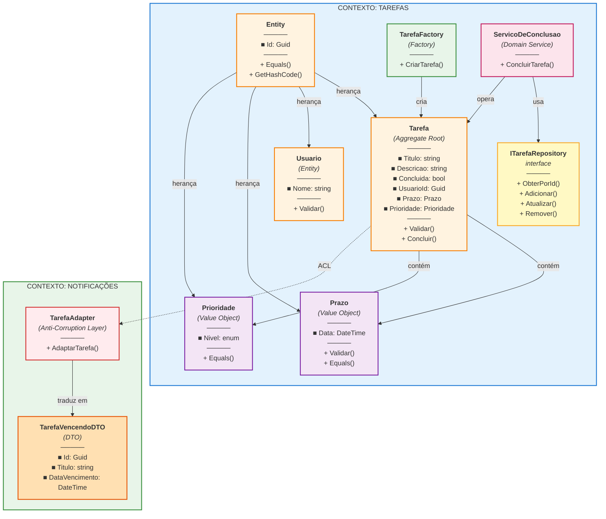

# 📋 Gerenciador de Tarefas

## 📌 Descrição do Projeto

O **Gerenciador de Tarefas** é uma aplicação que permite que usuários criem, gerenciem e controlem suas tarefas diárias. A aplicação fornece um sistema robusto para organizar trabalhos a serem realizados, atribuindo prazos e níveis de prioridade a cada tarefa, garantindo a integridade dos dados e o cumprimento das regras de negócio.

A solução foi desenvolvida utilizando **Domain-Driven Design (DDD)** como arquitetura principal, aplicando conceitos de **Orientação a Objetos**, **SOLID**, **GRASP** e **testes unitários** para garantir um código limpo, testável e facilmente extensível.

---

## 🎯 Problema a Resolver

**Problema identificado:**

Usuários precisam de uma forma simples, confiável e bem estruturada de gerenciar suas tarefas diárias. Frequentemente enfrentam:

- Dificuldade em organizar tarefas sem perder informações
- Necessidade de atribuir prazos e prioridades
- Risco de alterar tarefas já concluídas (causando inconsistências)
- Falta de um sistema que valide dados de entrada automaticamente
- Dificuldade em rastrear tarefas próximas do vencimento

**Exemplo de cenário problemático:**
```
Um usuário tenta:
1. Criar uma tarefa sem título (não deveria permitir)
2. Atribuir um prazo no passado (tarefa impossível de cumprir)
3. Concluir uma tarefa que já foi concluída (duplicação)

Sem validações, o sistema fica inconsistente.
```

---

## ✅ Solução Proposta

Desenvolver uma aplicação baseada em **Domain-Driven Design** que modele o domínio de tarefas de forma clara e centralizada, garantindo que:

- ✅ **As regras de negócio estejam no coração da aplicação** (camada de domínio)
- ✅ **Dados sejam validados no ponto de entrada** (construtores, value objects)
- ✅ **Operações complexas sejam coordenadas por domain services**
- ✅ **Código seja testável com cobertura >80%**
- ✅ **Princípios SOLID e GRASP sejam aplicados**

**Arquitetura:**
```
┌─────────────────────────────────────────┐
│    GerenciadorTarefas.Domain            │ ← Lógica de negócio pura
│  (Entities, ValueObjects, Services)     │
└─────────────────────────────────────────┘
         ↑                           ↑
         │                           │
    Infrastructure              Tests
 (Repository impl.)           (xUnit, Moq)
```

---

## 📊 Escopo do Projeto

### O que está DENTRO da aplicação:

- ✅ **Criação de tarefas** com título, descrição, prazo e prioridade
- ✅ **Validação de dados de entrada:**
  - Título obrigatório e não vazio
  - Prazo não pode ser no passado
  - Usuário ID obrigatório
- ✅ **Marcação de tarefas como concluídas**
- ✅ **Recuperação de tarefas por ID**
- ✅ **Atualização de tarefas existentes**
- ✅ **Exclusão de tarefas**
- ✅ **Notificações sobre tarefas próximas do vencimento** (via Anti-Corruption Layer)
- ✅ **Persistência de dados** (interface via Repository Pattern)
- ✅ **Testes unitários** com cobertura >80%

### O que está FORA da aplicação:

- ❌ **Interface gráfica (UI)** - apenas lógica de domínio
- ❌ **Autenticação e autorização** de usuários
- ❌ **Envio real de notificações** por email ou SMS
- ❌ **Relatórios e estatísticas** avançadas
- ❌ **Integração com calendários** externos
- ❌ **Sistema de permissões** granulares
- ❌ **Histórico de alterações** (Audit Log)
- ❌ **Sincronização** com sistemas externos
- ❌ **Implementação de Repositório** (apenas interface)

---

## 👥 Usuários do Sistema

### Usuários Diretos

**1. Usuário Final (Pessoa Física)**
- **Quem é:** Qualquer pessoa que precisa gerenciar suas tarefas
- **O que faz:**
  - Cria novas tarefas
  - Visualiza tarefas existentes
  - Marca tarefas como concluídas
  - Atualiza informações de tarefas
  - Exclui tarefas
- **Exemplo:** "João cria uma tarefa 'Estudar DDD' com prazo em 7 dias e prioridade Alta"

---

### Interfaces com Outros Sistemas

**2. Sistema de Notificações (Interface Externa)**
- **Quem é:** Serviço externo que envia alertas
- **O que recebe:**
  - ID da tarefa
  - Título da tarefa
  - Data de vencimento
- **Como integra:**
  - Via **Anti-Corruption Layer** (TarefaAdapter)
  - Recebe DTO traduzido (TarefaVencendoDTO)
  - Não conhece detalhes complexos da Tarefa original
- **Exemplo:** "Sistema de Notificações recebe alerta: 'Estudar DDD vence em 2 dias'"

**3. Banco de Dados (Interface de Persistência)**
- **Quem é:** Sistema de armazenamento de dados
- **O que faz:**
  - Persiste tarefas
  - Recupera tarefas por ID
  - Atualiza tarefas
  - Deleta tarefas
- **Como integra:**
  - Via **Repository Pattern** (ITarefaRepository)
  - Interface define contrato, implementação é agnóstica (SQL, MongoDB, etc)
- **Exemplo:** "Repository salva Tarefa no banco de dados"

---

## 🗣️ Ubiquitous Language (Linguagem Ubíqua)

A **Ubiquitous Language** é o vocabulário compartilhado entre o time de desenvolvimento e os especialistas de negócio. Todos falam a mesma linguagem sobre o domínio.

### Termos Principais do Domínio

| Termo | Definição | Contexto | Exemplo |
|-------|-----------|---------|---------|
| **Tarefa** | Unidade de trabalho que precisa ser realizada | Tarefas | "Criar uma tarefa para estudar DDD" |
| **Prazo** | Data até quando a tarefa deve ser concluída | Tarefas | "Prazo de 7 dias a partir de hoje" |
| **Prioridade** | Nível de importância da tarefa | Tarefas | "Tarefa com prioridade Alta" |
| **Concluir** | Marcar uma tarefa como finalizada | Tarefas | "Concluir a tarefa de estudar" |
| **Usuário** | Pessoa que cria e gerencia tarefas | Tarefas | "O usuário João criou a tarefa" |
| **Tarefa Vencendo** | Tarefa próxima do prazo (dentro de 3 dias) | Notificações | "A tarefa 'Estudar' está vencendo" |
| **Notificação** | Alerta sobre tarefa próxima do vencimento | Notificações | "Enviar notificação para o usuário" |
| **Adapter** | Tradutor de conceitos entre contextos | Integrações | "Adapter converte Tarefa em TarefaVencendoDTO" |
| **Contexto** | Limite explícito em torno de um modelo | Arquitetura | "Contexto de Tarefas e Contexto de Notificações" |

### Frases Comuns no Domínio

- **"Criar uma tarefa"** → Instanciar nova Tarefa via TarefaFactory
- **"Concluir uma tarefa"** → Chamar ServicoDeConclusao.ConcluirTarefa()
- **"Validar prazo"** → Verificar se data é futura no construtor de Prazo
- **"Tarefa vencendo"** → Tarefa com prazo próximo (< 3 dias)
- **"Integração entre contextos"** → TarefaAdapter traduz Tarefa para TarefaVencendoDTO

---

## 📋 Regras de Negócio

### Regra 1: Título da Tarefa é Obrigatório

**Descrição:** Uma tarefa não pode ser criada sem um título.

**Detalhes:**
- Campo: `Titulo` (string)
- Validação: Não pode ser nulo, vazio ou apenas espaços em branco
- Ação se violada: Lança `ArgumentException`

**Exemplo:**
```csharp
// ❌ Falha
var tarefa = new Tarefa("", "Descrição", usuarioId, prazo, prioridade);
// ArgumentException: "O título da tarefa é obrigatório."

// ✅ Passa
var tarefa = new Tarefa("Estudar DDD", "Descrição", usuarioId, prazo, prioridade);
```

---

### Regra 2: Prazo não pode ser no Passado

**Descrição:** Uma tarefa não pode ter prazo em uma data anterior à data atual.

**Detalhes:**
- Campo: `Prazo.Data` (DateTime)
- Validação: Deve ser sempre uma data futura (> DateTime.UtcNow)
- Ação se violada: Lança `ArgumentException`

**Exemplo:**
```csharp
// ❌ Falha
var prazo = new Prazo(DateTime.UtcNow.AddDays(-7));
// ArgumentException: "O prazo da tarefa deve ser uma data futura."

// ✅ Passa
var prazo = new Prazo(DateTime.UtcNow.AddDays(7));
```

---

### Regra 3: Tarefa Concluída não pode ser Alterada

**Descrição:** Uma tarefa que já foi marcada como concluída não pode ser concluída novamente.

**Detalhes:**
- Campo: `Concluida` (bool)
- Validação: Se já é true, não pode chamar `Concluir()` novamente
- Ação se violada: Lança `InvalidOperationException`

**Exemplo:**
```csharp
// ✅ Primeira conclusão passa
await servicoDeConclusao.ConcluirTarefa(tarefaId);
// Tarefa.Concluida = true

// ❌ Segunda conclusão falha
await servicoDeConclusao.ConcluirTarefa(tarefaId);
// InvalidOperationException: "A tarefa já está concluída."
```

---

## 🧪 Testes Unitários

A aplicação inclui **8 testes unitários** cobrindo todos os cenários de negócio:

### Testes de `Prazo.cs`

| Teste | Objetivo | Status |
|-------|----------|--------|
| `CriarPrazo_ComDataValida_DeveCriarComSucesso` | Validar que prazo com data futura é criado | ✅ |
| `CriarPrazo_ComDataPassada_DeveLancarExcecao` | Validar que prazo no passado lança exception | ✅ |

### Testes de `Tarefa.cs`

| Teste | Objetivo | Status |
|-------|----------|--------|
| `CriarTarefa_ComTituloValido_DeveCriarTarefa` | Validar que tarefa com título válido é criada | ✅ |
| `CriarTarefa_ComTituloInvalido_DeveLancarExcecao` | Validar que título vazio lança exception | ✅ |
| `CriarTarefa_ComPrazoPassado_DeveLancarExcecao` | Validar que prazo inválido lança exception | ✅ |
| `CriarTarefa_ComUsuarioVazio_DeveLancarExcecao` | Validar que usuário ID vazio lança exception | ✅ |

### Testes de `ServicoDeConclusao.cs`

| Teste | Objetivo | Status |
|-------|----------|--------|
| `ConcluirTarefa_ComTarefaValida_DeveConcluirComSucessoAsync` | Validar que tarefa válida é concluída | ✅ |
| `ConcluirTarefa_ComTarefaJaConcluida_DeveLancarExcecao` | Validar que reconclusão lança exception | ✅ |

---

## 📊 Diagrama da Arquitetura DDD



### Legenda de Componentes

| Cor | Componente | Descrição |
|-----|-----------|-----------|
| 🟧 Laranja | **Entities** | Objetos com identidade única (Id). Comparados pelo Id. |
| 🟪 Roxo | **Value Objects** | Objetos imutáveis comparados por valor (Prazo, Prioridade). |
| 🟩 Verde | **Factories** | Padrão criador. Responsabilidade: CRIAR agregados. |
| 🟥 Rosa | **Domain Services** | Padrão orquestrador. Responsabilidade: OPERAR sobre agregados. |
| 🟨 Amarelo | **Repositories** | Padrão persistência. Abstrai como dados são salvos. |
| 🔴 Vermelho | **Anti-Corruption Layer** | Traduz conceitos entre Bounded Contexts (desacoplamento). |
| 🟠 Laranja claro | **DTOs** | Objetos de transferência de dados entre contextos. |
| 🔵 Azul | **Bounded Contexts** | Limites de domínio isolados e independentes. |

### Relações Principais

- **Herança:** Tarefa, Usuario, Prazo e Prioridade herdam de Entity
- **Composição:** Tarefa contém Prazo e Prioridade (Value Objects)
- **Criação:** TarefaFactory cria novas instâncias de Tarefa
- **Persistência:** ServicoDeConclusao usa ITarefaRepository
- **Desacoplamento:** TarefaAdapter traduz Tarefa em TarefaVencendoDTO (ACL)

---